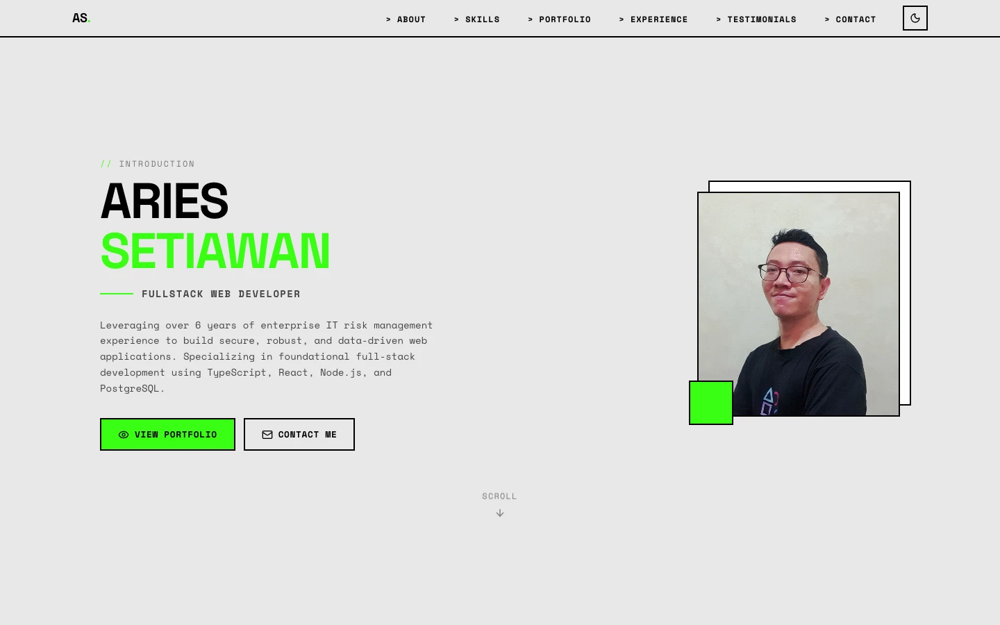

# 💻 Aries Setiawan - Personal Portfolio Website

A striking, high-performance personal portfolio website built with a modern Neo-Brutalist design system. This project showcases Aries Setiawan's transition from **Risk Management, Fraud Prevention, and Data Analytics** into **Full-Stack Software Engineering**.

<div align="center">

[](https://react.dev/)
[](https://vitejs.dev/)
[](https://www.typescriptlang.org/)
[](https://tailwindcss.com/)
[](https://github.com/pmndrs/zustand)
[](https://developer.chrome.com/docs/lighthouse/overview/)
[](https://opensource.org/licenses/MIT)

</div>

---

## 🎨 Visual Preview

Here is a preview of the Neo-Brutalist responsive layout and dark/light modes:

<div align="center">
  
</div>

---

## ✨ Key Features

- ⚡ **Neo-Brutalist Aesthetics**: Bold typography, high-contrast layouts, solid borders, and retro elements paired with modern micro-animations for a unique and memorable user experience.
- 🌓 **Dynamic Theme Switching**: Persistently saved dark/light modes implemented with state persistence using **Zustand**.
- ⚡ **Perfect Lighthouse Score**: Achieved a flawless 100/100 across Performance, Accessibility, Best Practices, and SEO by utilizing a statically optimized React build.
- 📂 **Static Data Management**: Dynamic project lists, details, and categories mapped cleanly via a centralized static data architecture for zero latency.
- 📬 **Reliable Contact System**: Secure contact form submission with input validation, error handling, and spam protection, integrated directly with **Web3Forms**.
- 🛠️ **Grouped Skill Classification**: Skills are dynamically grouped and presented in distinct categories:
  - **Hard Skills - Dev Skill** (Frontend, Backend, and developer tools).
  - **Hard Skills - AI Skill** (AI-assisted development, prompt engineering, and API integration).
  - **Non-Dev Skills** (Risk Management, Data Analytics, and Fraud Prevention).
  - **Soft Skills** (Communication, Teamwork, and Problem Solving).
- 📱 **Fully Responsive Layout**: Seamless transition and fluid layout adaptation for Mobile, Tablet, and Desktop screens.

---

## ⚙️ Installation & Setup

### 📋 Prerequisites

Ensure you have the following installed on your machine:
- **Node.js** (version 18 or higher recommended)
- **npm** or **yarn**

### 🛠️ Local Installation Steps

1. **Clone the Repository**:
   ```bash
   git clone https://github.com/awanstywn/bootcamp-exercise.git
   cd "02 Personal Website/profile-website"
   ```

2. **Install Dependencies**:
   ```bash
   npm install
   ```

3. **Configure Environment Variables**:
   Create a `.env` file in the root directory:
   ```bash
   touch .env
   ```
   Add the following config keys (you can check `.env.example` as a reference):
   ```env
   # Web3Forms access key for functioning contact form
   VITE_WEB3FORMS_ACCESS_KEY=your_web3forms_access_key
   ```

4. **Start Development Server**:
   ```bash
   npm run dev
   ```
   Open your browser to `http://localhost:5173`.

---

## 📂 Project Structure

The project has been organized following modular design standards for React:

```text
profile-website/
├── public/                  # Static assets (favicons, preview images)
│   └── preview.webp         # Visual mockup for README
├── src/
│   ├── assets/              # Source images, assets, PDF CV
│   │   ├── photo.jpeg       # Personal profile photo
│   │   └── cv.pdf           # Downloadable curriculum vitae
│   ├── components/          # Reusable UI parts & page sections
│   │   ├── Navbar.tsx       # Theme toggler & sticky navigation
│   │   ├── HeroSection.tsx  # Dynamic intro & call-to-actions
│   │   ├── AboutSection.tsx # Personal background description
│   │   ├── SkillsSection.tsx# Categorized dev & non-dev skills
│   │   ├── ExperienceSection.tsx # Chronological career history
│   │   ├── PortfolioSection.tsx  # Interactive list of CMS projects
│   │   ├── PortfolioDetailModal.tsx # Project detail modal dialog
│   │   ├── ContactSection.tsx    # Validated Web3Forms form
│   │   └── Footer.tsx       # Copyright details
│   ├── data/                # Static data architecture
│   │   └── constants.ts     # Project mapping and centralized content
│   ├── store/               # Lightweight state management
│   │   └── useThemeStore.ts # Zustand global state configuration (theme persistent storage)
│   ├── types/               # TypeScript interface configurations
│   │   └── index.ts         # Portfolio, Experience, and Skill types
│   ├── App.tsx              # Application layout root wrapper
│   ├── main.tsx             # DOM injection wrapper
│   └── index.css            # Custom CSS system configuration (Neo-Brutalist variables)
├── .env.example             # Guide for environment configs
├── tailwind.config.js       # Custom Tailwind CSS configuration rules
├── vite.config.ts           # Bundler config & alias mapping
└── tsconfig.json            # Strict TypeScript rules
```

---

## 🚀 Building & Production

To bundle the application into an optimized package for production hosting:

```bash
npm run build
```

This runs the compilation checks and compiles static HTML/CSS/JS bundles into the `dist/` directory. You can preview the compiled build locally using:

```bash
npm run preview
```

### 🌐 Suggested Hosting Providers
- **Vercel** (Highly recommended, instant static updates)
- **Netlify**
- **GitHub Pages**

---

## 📄 License

This repository is licensed under the **MIT License**. See the [LICENSE](LICENSE) file for more information.
