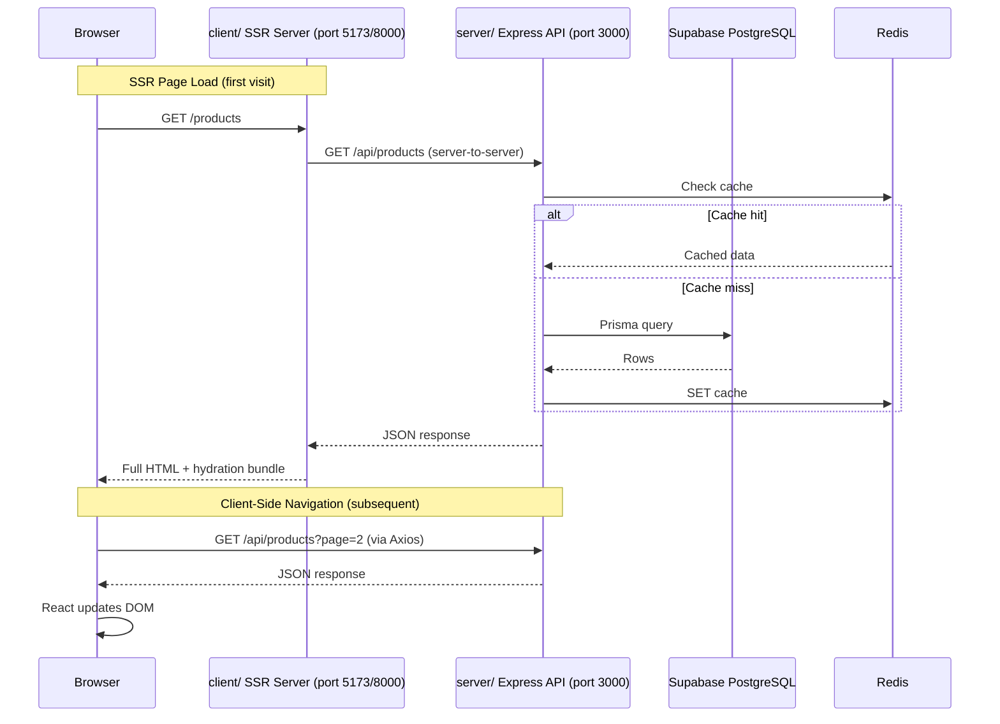

# Mini Grocery (Sembako) App — Implementation Plan

A fullstack, server-side-rendered grocery store application with Visitor (Buyer) and Admin (Store Owner) roles, built on the existing monorepo boilerplate.

---

## 1. Architecture Overview

### Monorepo Layout

The existing boilerplate already provides the three-workspace monorepo structure managed by **npm workspaces**:

| Workspace | Role |
|---|---|
| `client/` | SSR React frontend — Express server + Vite + `react-dom/server` |
| `server/` | Express.js + TypeScript API backend |
| `shared/` | Shared Zod schemas + TypeScript types consumed by both apps |

### Request Flow



**Development mode:** Vite dev server proxies `/api` requests to `localhost:3000`.
**Production/Docker:** `client/server.ts` uses `http-proxy-middleware` to forward `/api` to `localhost:3000`.

---

## 2. Tech Stack & Rationale

| Layer | Technology | Rationale |
|---|---|---|
| **Monorepo** | npm workspaces | Already scaffolded; no extra tooling needed |
| **Backend** | Express 5 + TypeScript | Already in boilerplate with middleware stack |
| **Frontend** | React 19 + Vite 8 (custom SSR) | Already configured with `entry-server.tsx`, `entry-client.tsx`, `StaticRouter` |
| **Styling** | TailwindCSS v4 | Already installed in client workspace |
| **State (Client)** | Zustand | Already installed; lightweight, SSR-friendly |
| **Routing (Client)** | React Router v7 | Already installed with `StaticRouter` SSR support |
| **Database** | Supabase (PostgreSQL) via Prisma + `@prisma/adapter-pg` | Already configured with PgBouncer pooler connection |
| **ORM** | Prisma 7 | Already set up with adapter-pg, singleton pattern, and migration scripts |
| **Validation** | Zod 4 | Already in server dependencies; schemas will live in `shared/` |
| **Auth** | Custom JWT (`jsonwebtoken` + `bcrypt`) | Already installed; httpOnly cookies for SSR auth state |
| **File Storage** | Cloudinary + Multer | Already configured in boilerplate; uploads product images and payment proofs to separate Cloudinary folders |
| **Caching** | Redis (ioredis) | Already configured with fail-open `CacheService` |
| **Queue** | BullMQ | Already configured; available for future use (emails skipped for MVP) |
| **Email** | Nodemailer | Already configured with Gmail SMTP; skipped for MVP |
| **Logging** | Winston | Already configured with file + console transports |
| **HTTP Client** | Axios | Already configured in `client/src/lib/axios.ts` with `withCredentials` |
| **Containerization** | Docker + Docker Compose | Already working with multi-stage Dockerfile |

---

## 3. Monorepo Folder Structure

Files marked with `[EXISTS]` are already in the boilerplate. Files marked with `[NEW]` will be created.

```
mini-grocery-app/
├── .dockerignore                          [EXISTS]
├── .eslintignore                          [EXISTS]
├── .gitignore                             [EXISTS]
├── .prettierrc                            [EXISTS]
├── Dockerfile                             [EXISTS]
├── README.md                              [EXISTS] — will be updated
├── docker-compose.yml                     [EXISTS]
├── eslint.config.mjs                      [EXISTS]
├── implementation_plan.md                 [NEW]
├── package.json                           [EXISTS]
├── package-lock.json                      [EXISTS]
│
├── shared/
│   ├── package.json                       [EXISTS]
│   └── src/
│       ├── types.ts                       [EXISTS] — will be expanded
│       ├── schemas/                       [NEW]
│       │   ├── auth.schema.ts             [NEW]
│       │   ├── category.schema.ts         [NEW]
│       │   ├── product.schema.ts          [NEW]
│       │   ├── cart.schema.ts             [NEW]
│       │   ├── order.schema.ts            [NEW]
│       │   └── index.ts                   [NEW]
│       └── enums.ts                       [NEW]
│
├── server/
│   ├── .env                               [EXISTS]
│   ├── .env.example                       [EXISTS]
│   ├── package.json                       [EXISTS]
│   ├── prisma.config.ts                   [EXISTS]
│   ├── tsconfig.json                      [EXISTS]
│   ├── prisma/
│   │   ├── schema.prisma                  [EXISTS] — will add models
│   │   ├── seed.ts                        [NEW]
│   │   └── migrations/                    [NEW] — auto-generated
│   └── src/
│       ├── app.ts                         [EXISTS]
│       ├── server.ts                      [EXISTS]
│       ├── config/
│       │   ├── cors.ts                    [EXISTS]
│       │   ├── env.ts                     [EXISTS] — will add JWT expiry vars
│       │   ├── logger.ts                  [EXISTS]
│       │   ├── queue.ts                   [EXISTS]
│       │   └── redis.ts                   [EXISTS]
│       ├── controllers/
│       │   ├── auth.controller.ts         [NEW]
│       │   ├── category.controller.ts     [NEW]
│       │   ├── product.controller.ts      [NEW]
│       │   ├── cart.controller.ts         [NEW]
│       │   ├── order.controller.ts        [NEW]
│       │   └── finance.controller.ts      [NEW]
│       ├── db/
│       │   └── prisma.ts                  [EXISTS]
│       ├── middleware/
│       │   ├── auth.middleware.ts          [NEW] — JWT verification
│       │   ├── rbac.middleware.ts          [NEW] — role-based access
│       │   ├── error.middleware.ts         [EXISTS]
│       │   ├── performance.middleware.ts   [EXISTS]
│       │   ├── rateLimiter.middleware.ts   [EXISTS]
│       │   ├── requestId.middleware.ts     [EXISTS]
│       │   └── validate.middleware.ts      [EXISTS]
│       ├── routes/
│       │   ├── index.ts                   [EXISTS] — will mount sub-routers
│       │   ├── auth.routes.ts             [NEW]
│       │   ├── category.routes.ts         [NEW]
│       │   ├── product.routes.ts          [NEW]
│       │   ├── cart.routes.ts             [NEW]
│       │   ├── order.routes.ts            [NEW]
│       │   └── finance.routes.ts          [NEW]
│       ├── services/
│       │   ├── auth.service.ts            [NEW]
│       │   ├── category.service.ts        [NEW]
│       │   ├── product.service.ts         [NEW]
│       │   ├── cart.service.ts            [NEW]
│       │   ├── order.service.ts           [NEW]
│       │   ├── finance.service.ts         [NEW]
│       │   ├── cache.service.ts           [EXISTS]
│       │   ├── email.service.ts           [EXISTS]
│       │   └── upload.service.ts          [EXISTS] — will be reused for product images + payment proofs
│       ├── types/
│       │   └── express.d.ts               [EXISTS] — will add `user` property
│       ├── utils/
│       │   ├── asyncHandler.ts            [EXISTS]
│       │   └── errors.ts                  [EXISTS]
│       └── validators/                    [EXISTS] — .gitkeep, import from shared
│
├── client/
│   ├── .env                               [EXISTS]
│   ├── index.html                         [EXISTS]
│   ├── package.json                       [EXISTS]
│   ├── postcss.config.js                  [EXISTS]
│   ├── server.ts                          [EXISTS]
│   ├── tsconfig.json                      [EXISTS]
│   ├── vite.config.ts                     [EXISTS]
│   └── src/
│       ├── App.tsx                        [EXISTS] — will add routes
│       ├── entry-client.tsx               [EXISTS]
│       ├── entry-server.tsx               [EXISTS]
│       ├── index.css                      [EXISTS] — will add Tailwind styles
│       ├── components/
│       │   ├── layout/                    [NEW]
│       │   │   ├── Navbar.tsx             [NEW]
│       │   │   ├── Footer.tsx             [NEW]
│       │   │   ├── AdminSidebar.tsx       [NEW]
│       │   │   ├── PublicLayout.tsx       [NEW]
│       │   │   └── AdminLayout.tsx        [NEW]
│       │   ├── ui/                        [NEW]
│       │   │   ├── Button.tsx             [NEW]
│       │   │   ├── Input.tsx              [NEW]
│       │   │   ├── Modal.tsx              [NEW]
│       │   │   ├── Card.tsx               [NEW]
│       │   │   ├── Badge.tsx              [NEW]
│       │   │   ├── Pagination.tsx         [NEW]
│       │   │   ├── Spinner.tsx            [NEW]
│       │   │   └── StatusBadge.tsx        [NEW]
│       │   ├── product/                   [NEW]
│       │   │   ├── ProductCard.tsx        [NEW]
│       │   │   ├── ProductGrid.tsx        [NEW]
│       │   │   └── ProductFilter.tsx      [NEW]
│       │   ├── cart/                      [NEW]
│       │   │   ├── CartItem.tsx           [NEW]
│       │   │   └── CartSummary.tsx        [NEW]
│       │   ├── order/                     [NEW]
│       │   │   ├── OrderCard.tsx          [NEW]
│       │   │   ├── OrderTimeline.tsx      [NEW]
│       │   │   └── PaymentUpload.tsx      [NEW]
│       │   └── admin/                     [NEW]
│       │       ├── ProductForm.tsx        [NEW]
│       │       ├── CategoryForm.tsx       [NEW]
│       │       ├── OrderTable.tsx         [NEW]
│       │       └── FinanceSummary.tsx     [NEW]
│       ├── hooks/                         [EXISTS]
│       │   ├── useAuth.ts                 [NEW]
│       │   ├── useProducts.ts             [NEW]
│       │   ├── useCart.ts                 [NEW]
│       │   └── useOrders.ts              [NEW]
│       ├── lib/
│       │   └── axios.ts                   [EXISTS] — will add interceptors
│       ├── pages/
│       │   ├── HomePage.tsx               [EXISTS] — will redesign
│       │   ├── LoginPage.tsx              [NEW]
│       │   ├── RegisterPage.tsx           [NEW]
│       │   ├── ProductsPage.tsx           [NEW]
│       │   ├── ProductDetailPage.tsx      [NEW]
│       │   ├── CartPage.tsx               [NEW]
│       │   ├── CheckoutPage.tsx           [NEW]
│       │   ├── OrdersPage.tsx             [NEW]
│       │   ├── OrderDetailPage.tsx        [NEW]
│       │   ├── NotFoundPage.tsx           [NEW]
│       │   └── admin/
│       │       ├── DashboardPage.tsx      [NEW]
│       │       ├── ProductsManagePage.tsx [NEW]
│       │       ├── CategoriesManagePage.tsx [NEW]
│       │       ├── OrdersManagePage.tsx   [NEW]
│       │       └── FinancePage.tsx        [NEW]
│       └── store/
│           ├── authStore.ts              [NEW]
│           └── cartStore.ts              [NEW]
```

---

## 4. Database Schema / ERD

```mermaid
erDiagram
    users {
        String id PK "cuid()"
        String email UK "unique"
        String password "hashed with bcrypt"
        String name
        String phone "nullable"
        UserRole role "ADMIN or VISITOR, default VISITOR"
        Boolean isActive "default true"
        DateTime createdAt "default now()"
        DateTime updatedAt "updatedAt"
    }

    categories {
        String id PK "cuid()"
        String name UK "unique"
        String slug UK "unique, URL-safe"
        String description "nullable"
        String imageUrl "nullable"
        Boolean isActive "default true"
        DateTime createdAt "default now()"
        DateTime updatedAt "updatedAt"
    }

    products {
        String id PK "cuid()"
        String categoryId FK
        String name
        String slug UK "unique"
        String description "nullable"
        Decimal price "Decimal 10 2"
        Int stock "default 0"
        String imageUrl "nullable"
        String unit "e.g. kg, pcs, liter"
        Boolean isActive "default true, soft delete"
        DateTime createdAt "default now()"
        DateTime updatedAt "updatedAt"
    }

    carts {
        String id PK "cuid()"
        String userId FK UK "unique, one cart per user"
        DateTime createdAt "default now()"
        DateTime updatedAt "updatedAt"
    }

    cart_items {
        String id PK "cuid()"
        String cartId FK
        String productId FK
        Int quantity "min 1"
        DateTime createdAt "default now()"
        DateTime updatedAt "updatedAt"
    }

    orders {
        String id PK "cuid()"
        String userId FK
        String orderNumber UK "auto-generated"
        OrderStatus status "enum, default PENDING_PAYMENT"
        DeliveryMethod deliveryMethod "PICKUP or DELIVERY"
        String shippingAddress "nullable, required if DELIVERY"
        Decimal totalAmount "Decimal 10 2"
        String paymentProofUrl "nullable"
        String rejectionReason "nullable"
        String verifiedById FK "nullable, references users.id"
        DateTime paidAt "nullable"
        DateTime verifiedAt "nullable"
        DateTime createdAt "default now()"
        DateTime updatedAt "updatedAt"
    }

    order_items {
        String id PK "cuid()"
        String orderId FK
        String productId FK
        String productName "snapshot at purchase time"
        Decimal price "snapshot at purchase time"
        Int quantity
        Decimal subtotal "price x quantity"
        DateTime createdAt "default now()"
    }

    users ||--o{ orders : "places"
    users ||--o| carts : "has one"
    users ||--o{ orders : "verifies as verifiedBy"
    categories ||--o{ products : "contains"
    products ||--o{ cart_items : "in cart"
    products ||--o{ order_items : "purchased as"
    carts ||--o{ cart_items : "contains"
    orders ||--o{ order_items : "contains"
```

### Key Constraints

| Constraint | Details |
|---|---|
| `cart_items` uniqueness | `@@unique([cartId, productId])` — prevents duplicate items; quantity is incremented instead |
| Soft delete | `products.isActive` and `categories.isActive` — filter with `WHERE isActive = true` for public queries |
| Order snapshots | `order_items.productName` and `order_items.price` are copied at checkout time to preserve order history |
| `verifiedById` | Self-referencing FK to `users.id` — records which admin verified/rejected the payment |
| Stock safety | Checkout uses `UPDATE ... WHERE stock >= quantity` conditional update to prevent overselling |

### Order Status Enum

```
PENDING_PAYMENT -> WAITING_VERIFICATION -> VERIFIED -> PROCESSING -> READY -> COMPLETED
                                           \-> REJECTED (exit)
PENDING_PAYMENT -> CANCELLED (by visitor, exit)
```

### Delivery Method Enum

```
PICKUP | DELIVERY
```

> [!IMPORTANT]
> The `READY` and `COMPLETED` statuses share the same enum values regardless of delivery method. The **UI** will display different labels (e.g., "Ready for Pickup" vs. "Out for Delivery"), but the backend treats them identically.

---

## 5. API Contracts

All responses follow the standard format:
```json
{ "success": true, "message": "string", "data": {}, "errors": null }
```

### Auth Endpoints

| Method | Path | Auth | Request Body | Response `data` |
|---|---|---|---|---|
| `POST` | `/api/auth/register` | Public | `{ email, password, name, phone? }` | `{ user: { id, email, name, role } }` |
| `POST` | `/api/auth/login` | Public | `{ email, password }` | `{ user: { id, email, name, role } }` + sets httpOnly cookies |
| `POST` | `/api/auth/logout` | Visitor/Admin | — | — (clears cookies) |
| `POST` | `/api/auth/refresh` | Cookie (refresh) | — | — (rotates access token cookie) |
| `GET` | `/api/auth/me` | Visitor/Admin | — | `{ user: { id, email, name, role } }` |

### Category Endpoints

| Method | Path | Auth | Request | Response `data` |
|---|---|---|---|---|
| `GET` | `/api/categories` | Public | Query: `?page, limit, search` | `{ categories: [...], meta: { page, limit, total, totalPages } }` |
| `GET` | `/api/categories/:slug` | Public | — | `{ category: { ...fields, products: [...] } }` |
| `POST` | `/api/categories` | Admin | `{ name, description?, image? }` (multipart) | `{ category: {...} }` |
| `PUT` | `/api/categories/:id` | Admin | `{ name?, description?, image? }` (multipart) | `{ category: {...} }` |
| `DELETE` | `/api/categories/:id` | Admin | — | — (soft delete: `isActive = false`) |

### Product Endpoints

| Method | Path | Auth | Request | Response `data` |
|---|---|---|---|---|
| `GET` | `/api/products` | Public | Query: `?page, limit, search, categoryId, sortBy, sortOrder, minPrice, maxPrice` | `{ products: [...], meta: {...} }` |
| `GET` | `/api/products/:slug` | Public | — | `{ product: {..., category: {...}} }` |
| `POST` | `/api/products` | Admin | `{ name, categoryId, description?, price, stock, unit, image? }` (multipart) | `{ product: {...} }` |
| `PUT` | `/api/products/:id` | Admin | `{ name?, categoryId?, description?, price?, stock?, unit?, image? }` (multipart) | `{ product: {...} }` |
| `DELETE` | `/api/products/:id` | Admin | — | — (soft delete: `isActive = false`) |

### Cart Endpoints

| Method | Path | Auth | Request | Response `data` |
|---|---|---|---|---|
| `GET` | `/api/cart` | Visitor | — | `{ cart: { items: [{ id, product: {...}, quantity }], totalItems, totalPrice } }` |
| `POST` | `/api/cart/items` | Visitor | `{ productId, quantity }` | `{ cart: {...} }` |
| `PUT` | `/api/cart/items/:itemId` | Visitor | `{ quantity }` | `{ cart: {...} }` |
| `DELETE` | `/api/cart/items/:itemId` | Visitor | — | `{ cart: {...} }` |
| `DELETE` | `/api/cart` | Visitor | — | — (clears all items) |

### Order Endpoints

| Method | Path | Auth | Request | Response `data` |
|---|---|---|---|---|
| `POST` | `/api/orders` | Visitor | `{ deliveryMethod, shippingAddress? }` | `{ order: {...} }` (creates from current cart) |
| `GET` | `/api/orders` | Visitor | Query: `?page, limit, status` | `{ orders: [...], meta: {...} }` (own orders only) |
| `GET` | `/api/orders/:id` | Visitor/Admin | — | `{ order: {..., items: [...]} }` (ownership check for visitor) |
| `POST` | `/api/orders/:id/payment-proof` | Visitor | multipart: `paymentProof` file | `{ order: {...} }` (status changes to WAITING_VERIFICATION) |
| `PUT` | `/api/orders/:id/cancel` | Visitor | — | `{ order: {...} }` (only from PENDING_PAYMENT) |

### Admin Order Management Endpoints

| Method | Path | Auth | Request | Response `data` |
|---|---|---|---|---|
| `GET` | `/api/admin/orders` | Admin | Query: `?page, limit, status, search, sortBy, sortOrder` | `{ orders: [...], meta: {...} }` |
| `PUT` | `/api/admin/orders/:id/verify` | Admin | — | `{ order: {...} }` (status changes to VERIFIED) |
| `PUT` | `/api/admin/orders/:id/reject` | Admin | `{ rejectionReason }` | `{ order: {...} }` (status changes to REJECTED, stock restored) |
| `PUT` | `/api/admin/orders/:id/process` | Admin | — | `{ order: {...} }` (status changes to PROCESSING) |
| `PUT` | `/api/admin/orders/:id/ready` | Admin | — | `{ order: {...} }` (status changes to READY) |
| `PUT` | `/api/admin/orders/:id/complete` | Admin | — | `{ order: {...} }` (status changes to COMPLETED) |

### Finance / Dashboard Endpoints

| Method | Path | Auth | Request | Response `data` |
|---|---|---|---|---|
| `GET` | `/api/admin/finance/summary` | Admin | Query: `?period` (daily/weekly/monthly) | `{ totalRevenue, totalOrders, completedOrders, pendingOrders, averageOrderValue }` |
| `GET` | `/api/admin/finance/transactions` | Admin | Query: `?page, limit, startDate, endDate, status` | `{ transactions: [...], meta: {...} }` |

---

## 6. RBAC / Access Control Matrix

| Feature | Public (No Auth) | Visitor (Buyer) | Admin (Store Owner) |
|---|---|---|---|
| Browse products and categories | Yes | Yes | Yes |
| Search and filter products | Yes | Yes | Yes |
| View product detail | Yes | Yes | Yes |
| Register / Login | Yes | — | — |
| View own profile | — | Yes | Yes |
| Manage cart (add/update/remove) | — | Yes | — |
| Checkout (create order) | — | Yes | — |
| Upload payment proof | — | Yes (own orders) | — |
| Cancel order | — | Yes (own, pending only) | — |
| View own order history | — | Yes | — |
| CRUD categories | — | — | Yes |
| CRUD products | — | — | Yes |
| View all orders | — | — | Yes |
| Verify/reject payment | — | — | Yes |
| Advance order status | — | — | Yes |
| View finance summary | — | — | Yes |

> [!IMPORTANT]
> Admin is a **single seeded account** — there is no public admin registration endpoint. The seed script creates the admin user.

---

## 7. Frontend Pages & Components

### Visitor Routes (Public Layout: `Navbar` + `Footer`)

| Route | Page Component | Key Components |
|---|---|---|
| `/` | `HomePage` | `ProductGrid`, `ProductCard`, `ProductFilter`, hero section |
| `/products` | `ProductsPage` | `ProductGrid`, `ProductCard`, `ProductFilter`, `Pagination` |
| `/products/:slug` | `ProductDetailPage` | Product image, info, add-to-cart `Button` |
| `/login` | `LoginPage` | `Input`, `Button` (form) |
| `/register` | `RegisterPage` | `Input`, `Button` (form) |
| `/cart` | `CartPage` | `CartItem`, `CartSummary`, `Button` (proceed to checkout) |
| `/checkout` | `CheckoutPage` | Delivery method selector, address `Input`, order summary |
| `/orders` | `OrdersPage` | `OrderCard`, `StatusBadge`, `Pagination` |
| `/orders/:id` | `OrderDetailPage` | `OrderTimeline`, `PaymentUpload`, order items list |
| `*` | `NotFoundPage` | 404 illustration |

### Admin Routes (Admin Layout: `AdminSidebar` + content area)

| Route | Page Component | Key Components |
|---|---|---|
| `/admin` | `DashboardPage` | `FinanceSummary` cards, recent orders table |
| `/admin/products` | `ProductsManagePage` | `ProductForm` (modal), product table, `Pagination` |
| `/admin/categories` | `CategoriesManagePage` | `CategoryForm` (modal), category table, `Pagination` |
| `/admin/orders` | `OrdersManagePage` | `OrderTable`, status filter tabs, action buttons |
| `/admin/finance` | `FinancePage` | Revenue chart, transaction table, date filters |

### Protected Route Logic

- Visitor-only pages (`/cart`, `/checkout`, `/orders/*`): redirect to `/login` if not authenticated.
- Admin pages (`/admin/*`): redirect to `/` if not authenticated or role is not `ADMIN`.
- Auth pages (`/login`, `/register`): redirect to `/` if already authenticated.

---

## 8. Environment Variables

### `server/.env`

| Variable | Required | Description |
|---|---|---|
| `NODE_ENV` | Yes | `development` / `production` / `test` |
| `PORT` | Yes | API server port (default `3000`) |
| `DATABASE_URL` | Yes | Supabase PostgreSQL connection string (pooler URL with `?pgbouncer=true`) |
| `JWT_ACCESS_SECRET` | Yes | Min 32 chars, for signing access tokens |
| `JWT_REFRESH_SECRET` | Yes | Min 32 chars, for signing refresh tokens |
| `JWT_ACCESS_EXPIRY` | Yes | Access token TTL, e.g., `15m` |
| `JWT_REFRESH_EXPIRY` | Yes | Refresh token TTL, e.g., `7d` |
| `CLIENT_URL` | Yes | Frontend URL for CORS (e.g., `http://localhost:5173`) |
| `SERVER_URL` | Yes | Backend URL (e.g., `http://localhost:3000`) |
| `REDIS_URL` | Yes | Redis connection string |
| `CACHE_TTL` | Yes | Default cache TTL in seconds (default `300`) |
| `CLOUDINARY_CLOUD_NAME` | Yes | Cloudinary cloud name (for product images + payment proofs) |
| `CLOUDINARY_API_KEY` | Yes | Cloudinary API key |
| `CLOUDINARY_API_SECRET` | Yes | Cloudinary API secret |
| `SMTP_HOST` | Optional | SMTP server hostname |
| `SMTP_PORT` | Optional | SMTP port |
| `SMTP_USER` | Optional | SMTP username |
| `SMTP_PASS` | Optional | SMTP password |

All validated at boot via Zod in `server/src/config/env.ts` (already exists, will be extended).

### `client/.env`

| Variable | Required | Description |
|---|---|---|
| `VITE_API_URL` | Yes | API base URL (default `/api` for proxy) |

---

## 9. Docker & Deployment Plan

### Existing Dockerfile Strategy (No Changes Needed)

The current `Dockerfile` already implements the correct multi-stage build:

**Stage 1 — Builder:**
1. Copy `package.json` files from all workspaces
2. `npm ci` (clean install)
3. Copy source code
4. `prisma generate`
5. `npm run build` (builds both client Vite SSR + server TypeScript)

**Stage 2 — Runner:**
1. Copy `package.json` files
2. `npm ci` (install runtime dependencies)
3. Copy built artifacts from builder (`client/dist`, `server/dist`, `shared`, prisma)
4. `prisma generate` in runner
5. Set `NODE_ENV=production`, `USER node`
6. `CMD ["npm", "run", "start:docker"]` — runs migrations + starts both servers

### `docker-compose.yml` (Current State)

```yaml
services:
  redis:
    image: redis:alpine
    container_name: apps_redis
    ports: ["6379:6379"]
    restart: unless-stopped

  app:
    image: apps:latest
    container_name: apps_container
    build: { context: ., dockerfile: Dockerfile }
    ports:
      - "3000:3000"  # Backend API
      - "8000:5173"  # Frontend SSR
    env_file: server/.env
    environment:
      - REDIS_URL=redis://redis:6379
      - CLIENT_URL=http://localhost:8000
    depends_on: [redis]
    restart: unless-stopped
```

> [!NOTE]
> No local PostgreSQL container is needed since we use **Supabase** as the hosted database. The `DATABASE_URL` is read from `server/.env` which points to Supabase's connection pooler.

---

## 10. Implementation Phases

### M1: Monorepo Foundation & Shared Package
- [ ] Move Zod to `shared/` dependencies; add as workspace dependency in both `server` and `client`
- [ ] Create `shared/src/enums.ts` — `UserRole`, `OrderStatus`, `DeliveryMethod`, `ProductUnit`
- [ ] Create `shared/src/schemas/` — auth, category, product, cart, order Zod schemas
- [ ] Expand `shared/src/types.ts` — align `ApiResponse` with `{ success, message, data?, errors? }`
- [ ] Update `server/src/config/env.ts` — add JWT expiry env vars, make Cloudinary vars required

### M2: Database Schema & Seed
- [ ] Write full Prisma schema in `server/prisma/schema.prisma` (all 7 models with relations/constraints)
- [ ] Run `prisma migrate dev` to generate the initial migration
- [ ] Create `server/prisma/seed.ts` — seed admin user (`admin@sembako.com` / `Admin123!`, hashed) + sample categories

### M3: Auth (Register / Login / Refresh / Logout)
- [ ] Create `server/src/services/auth.service.ts` — register, login, token generation/verification
- [ ] Create `server/src/controllers/auth.controller.ts`
- [ ] Create `server/src/routes/auth.routes.ts`
- [ ] Create `server/src/middleware/auth.middleware.ts` — JWT verification from httpOnly cookies
- [ ] Create `server/src/middleware/rbac.middleware.ts` — role checking middleware
- [ ] Update `server/src/types/express.d.ts` — add `user` to `Request`
- [ ] Mount auth routes in `server/src/routes/index.ts`

### M4: Categories + Products CRUD
- [ ] Create category service, controller, routes (admin CRUD + public read)
- [ ] Create product service, controller, routes (admin CRUD + public read with filters/pagination)
- [ ] Implement soft delete logic (`isActive = false`)
- [ ] Implement Redis caching for product/category listing (with cache invalidation on mutations)
- [ ] Use existing Cloudinary `upload.service.ts` for product image uploads (folder: `products`)
- [ ] Mount category and product routes

### M5: Cart (Visitor)
- [ ] Create cart service, controller, routes
- [ ] Implement auto-create cart on first add (one cart per user)
- [ ] Implement `@@unique([cartId, productId])` — upsert quantity on duplicate add
- [ ] Validate stock availability on add/update
- [ ] Mount cart routes

### M6: Checkout & Order Creation
- [ ] Create order service — checkout from cart
- [ ] Implement race-safe stock decrement (`UPDATE products SET stock = stock - :qty WHERE id = :id AND stock >= :qty`)
- [ ] Implement `deliveryMethod` validation (`shippingAddress` required for `DELIVERY`)
- [ ] Snapshot `productName` and `price` into `order_items`
- [ ] Clear cart after successful checkout
- [ ] Generate unique `orderNumber`
- [ ] Create order controller and routes
- [ ] Mount order routes

### M7: Payment Proof Upload & Admin Order Management
- [ ] Implement payment proof upload endpoint (Cloudinary folder: `payment-proofs`)
- [ ] Implement status transitions with validation (e.g., `verify` only from `WAITING_VERIFICATION`)
- [ ] Implement `reject` with `rejectionReason` and stock restoration
- [ ] Implement `cancel` by visitor (only from `PENDING_PAYMENT`) with stock restoration
- [ ] Record `verifiedById` on verify/reject
- [ ] Create admin order routes under `/api/admin/orders`

### M8: Finance Summary / Dashboard (Admin)
- [ ] Create finance service — aggregate revenue, order counts, average order value by period
- [ ] Create transaction history endpoint with date range filtering
- [ ] Create finance controller and routes under `/api/admin/finance`

### M9: Frontend — UI Components & Layouts
- [ ] Set up Tailwind design tokens in `index.css` (colors, typography, spacing)
- [ ] Build reusable UI components (`Button`, `Input`, `Modal`, `Card`, `Badge`, `Pagination`, `Spinner`, `StatusBadge`)
- [ ] Build layout components (`Navbar`, `Footer`, `AdminSidebar`, `PublicLayout`, `AdminLayout`)
- [ ] Set up Zustand stores (`authStore`, `cartStore`)
- [ ] Configure Axios interceptors (401 then refresh token then retry, or redirect to login)

### M10: Frontend — Visitor Pages
- [ ] `HomePage` — hero banner, featured products, categories
- [ ] `LoginPage` + `RegisterPage` — forms with Zod client-side validation
- [ ] `ProductsPage` — grid with filters, search, pagination
- [ ] `ProductDetailPage` — product info, add to cart
- [ ] `CartPage` — cart items, quantity adjustment, remove, proceed to checkout
- [ ] `CheckoutPage` — delivery method, address input, order summary, confirm
- [ ] `OrdersPage` — list own orders with status badges
- [ ] `OrderDetailPage` — order timeline, payment proof upload
- [ ] `NotFoundPage` — 404 page
- [ ] Wire all routes in `App.tsx` with protected route wrappers

### M11: Frontend — Admin Pages
- [ ] `DashboardPage` — summary cards, recent orders
- [ ] `ProductsManagePage` — CRUD table with modal form
- [ ] `CategoriesManagePage` — CRUD table with modal form
- [ ] `OrdersManagePage` — order table with status filter tabs, action buttons
- [ ] `FinancePage` — revenue overview, transaction history table
- [ ] Wire admin routes in `App.tsx` with admin-only route wrapper

### M12: Docker, Testing & Final Polish
- [ ] Run `docker-compose up --build` end-to-end and verify all flows
- [ ] Test complete visitor flow: register, browse, add to cart, checkout, upload payment
- [ ] Test complete admin flow: login, manage products, verify payment, advance order
- [ ] Update `README.md` with final project documentation
- [ ] Final review of all API endpoints and frontend pages

---

## 11. Resolved Decisions

All open questions have been resolved:

| # | Question | Decision |
|---|---|---|
| Q1 | File Storage | **Keep Cloudinary** — use existing `upload.service.ts` with folders `products/` and `payment-proofs/`. No Supabase Storage needed. |
| Q2 | Admin Seed Credentials | Email: `admin@sembako.com`, Password: `Admin123!` (hashed with bcrypt) |
| Q3 | Product Units | **Fixed enum** (`ProductUnit`) with dropdown: `KG`, `PCS`, `LITER`, `PACK`, `GRAM`, `DOZEN` |
| Q4 | Payment Info | **Hardcoded** bank account details displayed on checkout/pending payment page |
| Q5 | Email Notifications | **Skipped for MVP** — email service exists but won't be wired to order events |
| Q6 | SSR Data Fetching | **Use existing mechanism** — the current SSR setup in `client/server.ts` and `entry-server.tsx` stays as-is |
