# Mini Grocery Application - Workflow & Architecture Mapping

This document explains the backend architecture, the request flow of the API, and how the codebase structure maps directly to the project requirements.

---

## 1. Requirement Mapping to Codebase

| Requirement | Implementation & File Mapping |
| :--- | :--- |
| **Express.js + TypeScript** | Configured in `package.json`, `tsconfig.json`. Entry point is `src/server.ts` and the main Express app is defined in `src/app.ts`. |
| **Supabase (PostgreSQL) & Prisma** | Managed via Prisma ORM. Schema is defined in `prisma/schema.prisma`. Database connection string is injected via `.env` (using `DATABASE_URL` pointing to Supabase). The singleton Prisma client lives in `src/db/prisma.ts`. |
| **Docker Containerization** | `Dockerfile` defines a two-stage build (builder for compiling TS, runner for production execution). `docker-compose.yml` orchestrates the app and maps ports/environments. Startup script (`npm run start:docker`) includes DB schema pushing and seeding. |
| **User Roles (Admin vs. Visitor)** | Defined as the `UserRole` enum in `prisma/schema.prisma` (`ADMIN` and `VISITOR`). Assigned during Registration (`src/controllers/auth.controller.ts`) and checked via the JWT payload. |
| **Role-Based Access Control (RBAC)** | Enforced using Express middleware: `src/middleware/auth.middleware.ts` ensures a valid JWT exists, and `src/middleware/rbac.middleware.ts` restricts specific routes (like POST/PUT/DELETE products) to `ADMIN` only. |
| **Input Data Validation (Zod)** | Zod schemas are defined in `src/validators/*.validator.ts`. The `validate.middleware.ts` intercepts requests, parses the `req.body`/`req.query` against the Zod schema, and throws standardized validation errors if it fails. |
| **Standardized JSON Responses** | All controllers respond with `{ success: boolean, message: string, data?: any }` to maintain a strict API contract. |
| **Comprehensive Error Handling** | `src/utils/errors.ts` defines custom Error classes (`AppError`, `NotFoundError`, etc.). `src/middleware/error.middleware.ts` catches all unhandled exceptions, normalizes Prisma/Zod errors, logs them using Winston, and returns standard HTTP responses. |

---

## 2. Global Request Lifecycle (Workflow)

When a client (like Yaak or a Web Browser) sends an HTTP request, it goes through a strict pipeline before reaching the database.

```mermaid
sequenceDiagram
    participant Client
    participant Express(app.ts)
    participant Global Middleware
    participant Route Middleware
    participant Controller
    participant Service/DB
    
    Client->>Express(app.ts): HTTP Request (e.g. POST /api/orders)
    
    rect rgb(30, 30, 30)
        Note right of Express(app.ts): 1. Security & Parsing Layer
        Express(app.ts)->>Global Middleware: helmet(), cors(), express.json()
    end
    
    rect rgb(30, 30, 30)
        Note right of Express(app.ts): 2. Authentication & Authorization
        Global Middleware->>Route Middleware: auth.middleware (Verify JWT)
        Route Middleware->>Route Middleware: rbac.middleware (Check Admin role if needed)
    end
    
    rect rgb(30, 30, 30)
        Note right of Express(app.ts): 3. Validation
        Route Middleware->>Route Middleware: validate.middleware (Zod Schema parsing)
    end
    
    rect rgb(30, 30, 30)
        Note right of Express(app.ts): 4. Business Logic
        Route Middleware->>Controller: req.body / req.user
        Controller->>Service/DB: Prisma Client Queries
        Service/DB-->>Controller: Return Database Entity
    end
    
    rect rgb(30, 30, 30)
        Note right of Express(app.ts): 5. Response / Error Handling
        Controller-->>Client: Standardized JSON Response (200 OK)
        Controller--xExpress(app.ts): (If Error Thrown) Catch by express-async-errors
        Express(app.ts)-->>error.middleware: Handle Custom/Prisma/Zod Error
        error.middleware-->>Client: Standardized JSON Error Response (4xx / 500)
    end
```

---

## 3. Deep Dive: Key Architectural Files

### A. The Core Logic (`src/controllers` & `src/routes`)
- **`routes/*.ts`**: Declares HTTP methods and maps them to controllers. It is here that middleware (Auth, RBAC, Validation) is injected into the pipeline. 
  - *Example:* `router.post('/', authenticate, requireRole(UserRole.ADMIN), validate(createProductSchema), createProduct);`
- **`controllers/*.ts`**: Contains the core business logic. Extracts validated data from the request, queries Prisma, and sends the response. They are wrapped in async handlers to ensure errors automatically trigger the error middleware.

### B. Security & Validation (`src/middleware` & `src/validators`)
- **`validate.middleware.ts`**: The bridge between Zod schemas and Express. It safely parses incoming JSON bodies. If parsing fails, it immediately throws a `ValidationError`, halting the request before it reaches the controller.
- **`auth.middleware.ts`**: Parses the HTTP-Only `accessToken` cookie or `Authorization` header, verifies the JWT using the secret, and attaches the decoded `req.user` payload (including Role and Email) to the Request object.
- **`rbac.middleware.ts`**: Checks `req.user.role`. If a route requires `ADMIN` and the user is a `VISITOR`, it throws a `ForbiddenError`.

### C. Database Layer (`prisma/schema.prisma`)
The single source of truth for the data shape. It maps TypeScript types directly to PostgreSQL tables. Highlights:
- Uses `@default(cuid())` for secure, conflict-free unique identifiers.
- Defines enums for `OrderStatus` (State Machine enforcement) and `UserRole`.
- Manages relational links (e.g., A `User` has many `Order`s, a `Category` has many `Product`s).

### D. File Uploads (`src/middleware/upload.middleware.ts`)
Handles multipart/form-data specifically for the `Visitor` when uploading Payment Proofs (`/api/orders/:id/payment-proof`). Utilizes Multer and pipes the image to a local `/app/uploads` folder (or Cloudinary, depending on configuration).

---

## 4. Conclusion
This modular approach ensures that **Security**, **Validation**, and **Error Handling** are separated from business logic. By pushing validation to middleware and database interaction to Prisma, the controllers remain thin and strictly focused on orchestrating the workflow.
